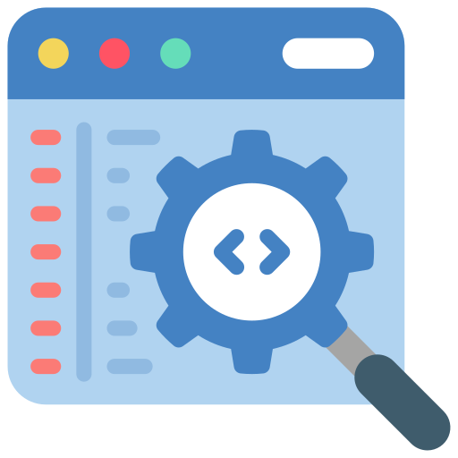
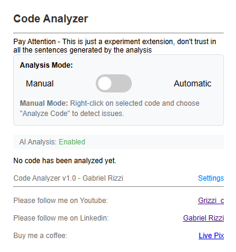

<!-- PROJECT LOGO -->
 

  

<h3 align="center">Code Analyzer</h3>

  

    Este é uma extensão do google chrome com o objetivo de facilitar a análise de códigos dentro do próprio navegador integrado com o GPT! 
  

## About The Project

 

An AI-powered browser extension designed for developers, integrating cutting-edge AI to analyze selected code in real time. It provides intelligent feedback on best practices, performance, security vulnerabilities, and compliance with AppSec and DevSecOps principles. By leveraging AI-driven insights, it helps enhance code quality, detect security flaws early, and streamline secure development workflows. Perfect for developers who want to code smarter, faster, and more securely with AI assistance.

### Built With

* [![javascript][js]][js-url]
* ![html_WithoutCode][html]

<!-- GETTING STARTED -->
## Getting Started

We are still waiting for the extension to be published on the chrome store

### Installation

## Usage

1 - First you install the extension using Chrome Store

2 - You will see in the first page of the extension two options: 
 **Manual**: With this option select you will be able to select the code and with the right click send the code for extensions analysis

 
 **Automatic**: In this option the extension will automatic detect the code in your tab and generate the feedback 
 

3 - If you would like to add some tips using IA integration, you have to paste the GPT API Key in "settings" section and save it

<!-- ROADMAP -->
## Roadmap

- [✅] Feature 1
   - [✅] Auto and Manual Detect
   - [✅] IA API Integration
   - [✅] Local detect using patterns
- [ ] Feature 2
  - [ ] Integration with local API
  - [ ] Option for auto integration with API without paste Key
  - [ ] Refine detection
  - [ ] Report Generate

<!-- CONTACT -->
## Contact

Gabriel Rizzi - gabrielsrizzi@gmail.com

<!-- MARKDOWN LINKS & IMAGES -->
<!-- https://www.markdownguide.org/basic-syntax/#reference-style-links -->
[contributors-shield]: https://img.shields.io/github/contributors/github_username/repo_name.svg?style=for-the-badge
[contributors-url]: https://github.com/github_username/repo_name/graphs/contributors
[forks-shield]: https://img.shields.io/github/forks/github_username/repo_name.svg?style=for-the-badge
[forks-url]: https://github.com/github_username/repo_name/network/members
[stars-shield]: https://img.shields.io/github/stars/github_username/repo_name.svg?style=for-the-badge
[stars-url]: https://github.com/github_username/repo_name/stargazers
[issues-shield]: https://img.shields.io/github/issues/github_username/repo_name.svg?style=for-the-badge
[issues-url]: https://github.com/github_username/repo_name/issues
[license-shield]: https://img.shields.io/github/license/github_username/repo_name.svg?style=for-the-badge
[license-url]: https://github.com/github_username/repo_name/blob/master/LICENSE.txt
[linkedin-shield]: https://img.shields.io/badge/-LinkedIn-black.svg?style=for-the-badge&logo=linkedin&colorB=555
[linkedin-url]: https://linkedin.com/in/linkedin_username
[product-screenshot]: images/screenshot.png
[js]: https://img.shields.io/badge/javascript-000000?style=for-the-badge&logo=javascript&logoColor=white
[js-url]: https://www.javascript.com/
[html]: https://img.shields.io/badge/html-000000?style=for-the-badge&logo=html5&logoColor=white
